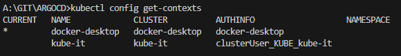

# **COMANDOS CLI ARGO**

Instalar el chart de ArgoCD para poder manipular archivos de manifiesto, como tambien el CLI de Argo.

* Lanzar proxy argo para poder levantar Argo sin exponer el servicio, se recomienda utilizar otra terminar:

```
kubectl port-forward svc/argocd-server -n argocd 8080:443
```

* Para modificar el service (asi no hay necesidad de inicializar el forward), y que pueda estar en NodePort:

```
kubectl patch svc argocd-server -n argocd -p "{\"spec\": {\"type\": \"NodePort\", \"ports\": [{\"name\": \"http\", \"nodePort\": 30080, \"port\": 80, \"protocol\": \"TCP\", \"targetPort\": 8080}, {\"name\": \"https\", \"nodePort\": 30443, \"port\": 443, \"protocol\": \"TCP\", \"targetPort\": 8080}]}}"
```

* Verificar la clave de admin:

```
argocd admin initial-password -n argocd
```

* Loguerase:

```
argocd login localhost:8080
```

* Crear proyecto:

```
argocd app create pokedex-local-it --repo https://github.com/abelucci/KUBERNETES.git --path POKEDEX --dest-server https://kubernetes.default.svc --dest-namespace default
```

* Verificar proyectos creados:

```
kubectl get applications -n argocd
```


# **LANZAR APP EN AZURE**

Crear cluster en la nube para poder implementar el servicio.

* Login en azure:

  ```
  az login
  ```
* Crear grupo de recursos y locación:

  ```
  az group create --name <myResourceGroup> --location eastus
  ```
* Crear clúster:

  ```
  az aks create -n <nombredelcluster> -g <nombredelrecurso>
  ```
* Verificar:

  ```
  az aks list -o table
  ```
* Conectarse al cluster mediante kubectl en localhost:

  ```
  az aks get-credentials -n <name cluster> -g <name recurso> (obtengo credenciales de acceso mediante kubectl) asi se guarda en el archivo user/<user>/.kube/config
  az aks get-credentials -n kube-it -g KUBE
  ```
* Verificar los clusteres creados:

  ```
  kubectl config get-contexts
  ```
  
* Seleccionar el cluster donde vamos a trabajar:

  ```
  kubectl config use-context <nombre del cluster>
  ```
